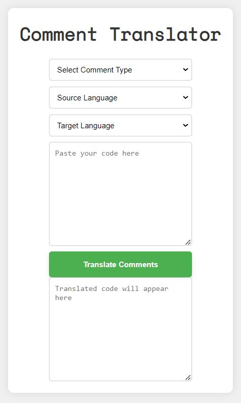

# Comment Translator

## Overview

The Comment Translator is a simple web application that allows you to translate comments within code snippets from one language to another. It supports comments in Python, C#, and HTML, and provides a straightforward interface to select the comment type, source language, and target language.

## Features

- **Comment Type Selection**: Choose between Python, C#, and HTML comment styles.
- **Language Selection**: Translate comments between multiple languages.
- **Code Input**: Paste your code with comments to be translated.
- **Translated Output**: View the translated code with comments in the target language.

## How It Works

1. **Select Comment Type**: Choose the type of comment syntax used in your code.
2. **Select Source and Target Languages**: Specify the language you are translating from and the language you are translating to.
3. **Paste Code**: Input the code containing comments that need to be translated.
4. **Submit Form**: Click the "Translate Comments" button to process the code and display the translated comments.

## Setup and Usage

1. **Open `index.html`**: Open the HTML file in your web browser.

2. **Include mtranslate Library**: The application uses the mtranslate library for translation, which is included via a CDN in the script tag.

3. **Customize**: You can add more languages to the dropdowns by modifying the `sourceLang` and `targetLang` options in the HTML form.

## Code Explanation

- **HTML Structure**: Defines the layout of the translator including form fields and output areas.
- **CSS Styling**: Provides basic styling and layout adjustments for a clean user interface.
- **JavaScript Logic**: Handles form submission, comment extraction, and translation using the mtranslate library.

## Dependencies

- **mtranslate Library**: Included via CDN for translation functionality.

## Example Usage

1. Select "Python" as the comment type.
2. Choose "English" as the source language and "Spanish" as the target language.
3. Paste your Python code with comments into the "Paste your code here" textarea.
4. Click the "Translate Comments" button.
5. View the translated code with comments in Spanish in the output textarea.

## Contributing

Feel free to fork the repository and submit pull requests with improvements or new features. Issues and feature requests are welcome.

